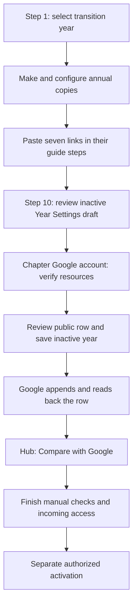

# System flow and ownership

The Hub guides the transition. Google's authenticated save service checks the
annual resources and writes an inactive settings row to Google Sheets. The Hub
reads shared settings from that sheet. The attendance Form is a separate system;
the annual save does not submit a Hub Settings Google Form.

The seven links identify the annual folder, Points Master, Form editor, Form
respondent, Points Export, Budget Tracker and Budget Export. The guide stores
them on the officer's device and checks their format, duplicates and known
template identities. Those browser checks do not prove Google access or save
shared settings. Changing a link can reopen dependent checks.

At Step 10, **Open authorized annual save** transfers the reviewed draft to the
Google page. Download/import of the save JSON is a fallback. Loading either input
only fills the page. The officer chooses **Verify with Google**, reviews the exact
twenty-cell public row and its audience, then chooses **Save inactive year and
confirm**. Google repeats its checks, journals intent, appends once and checks
readback. An unchanged repeat reads the existing row rather than duplicating it.
Return to the Hub for **Compare with Google**, which performs an independent
fresh read. Neither action activates the year.

## Hosting and storage

| Component | Host/control | What is stored there |
|---|---|---|
| Hub website and source | ASME-OSU GitHub organization / GitHub Pages | Public HTML, browser scripts, defaults and documentation |
| Annual Verify and Save service | Chapter-owned standalone Google Apps Script project | Authenticated server code; self-only deployment running as the accessing chapter account |
| Control Center | Chapter Google Drive / Sheets | Shared `Hub_Settings_Public` rows; the entire workbook is publicly readable |
| Templates and annual copies | Chapter Google Drive | Canonical masters and new-year files; private masters are separate from reviewed public exports |
| Rules, ledgers and operational evidence | Chapter's private administrative/handoff folders | Trusted configuration, operation history, source snapshots and acceptance records |
| Guide progress, link drafts, personal links | Each officer's browser | Local state; export/import is needed to move it between devices |
| Other officer tools | Existing Ohio State, Microsoft 365, newsletter and finance services | Separate accounts and access controls; their ownership/access is not certified by this save service |

The Google project's owner was checked as the ASME chapter account, with
restricted access. The Hub lives in ASME-OSU's GitHub organization. There is no
additional personal hosting server. A developer's Git author name is different
from ownership of the Google files. The Hub access phrase and role selector do
not grant Google or Microsoft authorization.

## What is checked

Google verification checks file identity, type, chapter ownership, editability,
folder ancestry, allowed permissions and excluded templates/originals/fixtures.
It checks a closed Form and its actual destination, response headers and empty
test body, Points configuration, budget dates, export schemas and the complete
reviewed import-formula inventory. The save engine checks the settings schema,
unique years, active/current flags and an unchanged baseline. Its review expires
after 30 minutes; save takes the project lock and checks resources again.

Officers still check response delivery/scoring, bound scripts and triggers,
public export contents, finance totals/authority, incoming access and independent
consumers. The service does not mark those checks PASS, open responses, change
sharing or activate a year. See the [verification contract](../../integrations/apps-script/MANUAL_ANNUAL_VERIFICATION.md)
for the exact conditions.

The public data flow is **attendance Form → private Points Master → reviewed
Points Export → Hub**, with **private Budget Tracker → Budget Export → Hub**.
The Hub also reads shared settings and the public chapter calendar. Published
settings contain public references even when the linked destination is private;
hidden tabs do not protect anything in a publicly readable workbook.

For current-year gear-panel edits, **Preview and refresh** affects that browser
tab. **Edit shared settings** opens Google Sheets for an authorized shared edit;
**Compare with Google** checks the intended saved values. The authenticated
annual save handles the new inactive row.
