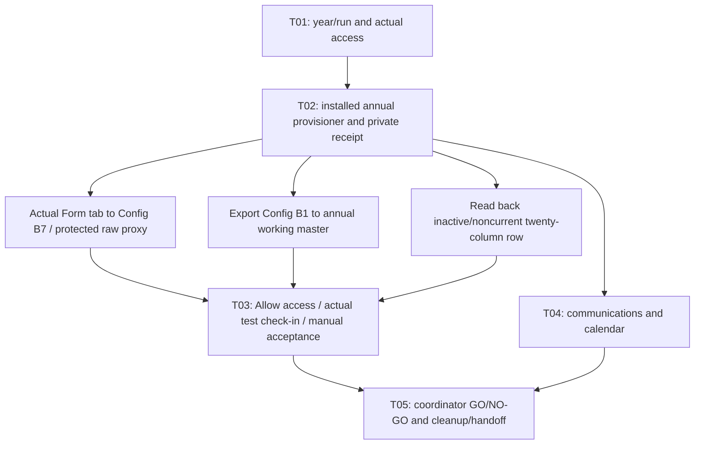

# System flow and ownership

The Hub guides the transition. Google's authenticated save service checks the
annual resources and writes an inactive settings row to Google Sheets. The Hub
reads shared settings from that sheet. The attendance Form is a separate system;
the annual save does not submit a Hub Settings Google Form.

The current guide7 has five steps. The new helpers have native saved/reopened source readback: three standalone files and EventSync/SanityCheck in the canonical master’s bound project, with normalized hashes matching reviewed source. This verifies installed editor source, not annual execution or web deployment. No canonical trigger was created; the existing web deployment remains version3. Bound-menu pre-flight, chapter configuration/authorization, copied-file inheritance, automatic trigger and full provisioner/Form/import acceptance remain pending. Desktop Allow access/resolved-output and ordinary-browser acceptance remain pending. Do not execute the older installed bundle until its retirement guard is updated/read back; never run legacy bulk setup against proxy templates. Saving new helper files does not update the existing deployed web version. Native proxy calculations and centralized pointer inheritance are narrower verified subchecks.

Once installed, the chapter-admin operator calls `provisionReviewedAnnualYear(year)`; `provision2027_2028` is the editor entry for 2027–2028. The fall term is derived. The maintainer configures chapter root, Control Center, approved positive goal and calendar source once. AnnualProvisioner creates/resumes five private copies, observes Google's actual Form response tab, writes pointers/dates and reads back the inactive row. It performs initial event sync only. In the copied Points Master's bound **ASME Tools** menu, the chapter operator runs **Sync Events to Google Form**, then **Enable automatic event sync** once and verifies that bound project's edit trigger. Do not add a second standalone trigger.

Protected `_Raw_Ingest` reads Config B7; Roster/Point Log use stable proxy references. Both exports centralize import source IDs at Config B1 (six Points/35 Budget formula cells). One-time canonical migration belongs to the maintainer; annual copies do not require bulk formula replacement.

The guide stores seven actual copied-file links by named run on the officer's device. Format/duplicate/template checks do not certify Google access. Old sixteen-step originals remain preserved during migration; passed checks reopen. A rehearsal or imported completion never authorizes production T05. Cleanup/handoff remains available after NO-GO.

The older authenticated annual-save service is a separate fallback/reconciliation route: **Open authorized annual save**, **Verify with Google**, review the public twenty-cell row/audience, **Save inactive year and confirm**, then independent **Compare with Google**. Its installation receipt does not certify the new helpers. Neither route activates the year, opens intake, grants sharing or approves a send.

## Hosting and storage

| Component | Host/control | What is stored there |
|---|---|---|
| Hub website and source | ASME-OSU GitHub organization / GitHub Pages | Public HTML, browser scripts, defaults and documentation |
| Annual Verify and Save service | Chapter-owned standalone Google Apps Script project | Authenticated server code; self-only deployment running as the accessing chapter account |
| Control Center | Chapter Google Drive / Sheets | Shared `Hub_Settings_Public` rows; the entire workbook is publicly readable |
| Templates and annual copies | Chapter Google Drive | Canonical masters and new-year files; private masters are separate from reviewed public exports |
| Rules, ledgers and operational evidence | Chapter's private administrative/handoff folders | Trusted configuration, operation history, source snapshots and acceptance records |
| Guide progress, link drafts, personal links | Each officer's browser | Local state; export/import is needed to move it between devices |
| Other officer tools | Existing Ohio State, Microsoft 365, newsletter and finance services | Separate accounts and access controls; their ownership/access is not certified by this save service |

The Google project's owner was checked as the ASME chapter account, with
restricted access. The Hub lives in ASME-OSU's GitHub organization. There is no
additional personal hosting server. A developer's Git author name is different
from ownership of the Google files. The Hub access phrase and role selector do
not grant Google or Microsoft authorization.

## Existing authenticated annual-save verification scope

Google verification checks file identity, type, chapter ownership, editability,
folder ancestry, allowed permissions and excluded templates/originals/fixtures.
It checks a closed Form and its actual destination, response headers and empty
test body, Points configuration, budget dates, export schemas and the complete
reviewed import-formula inventory. The save engine checks the settings schema,
unique years, active/current flags and an unchanged baseline. Its review expires
after 30 minutes; save takes the project lock and checks resources again.

Officers still check response delivery/scoring, bound scripts and triggers,
public export contents, finance totals/authority, incoming access and independent
consumers. The service does not mark those checks PASS, open responses, change
sharing or activate a year. See the [verification contract](../../integrations/apps-script/MANUAL_ANNUAL_VERIFICATION.md)
for the exact conditions.

The public data flow is **attendance Form → private Points Master → reviewed
Points Export → Hub**, with **private Budget Tracker → Budget Export → Hub**.
The Hub also reads shared settings and the public chapter calendar. Published
settings contain public references even when the linked destination is private;
hidden tabs do not protect anything in a publicly readable workbook.

For current-year gear-panel edits, **Preview and refresh** affects that browser
tab. **Edit shared settings** opens Google Sheets for an authorized shared edit;
**Compare with Google** checks the intended saved values. The reviewed provisioner or existing authenticated fallback handles an inactive row; keep their installation/acceptance receipts distinct.
